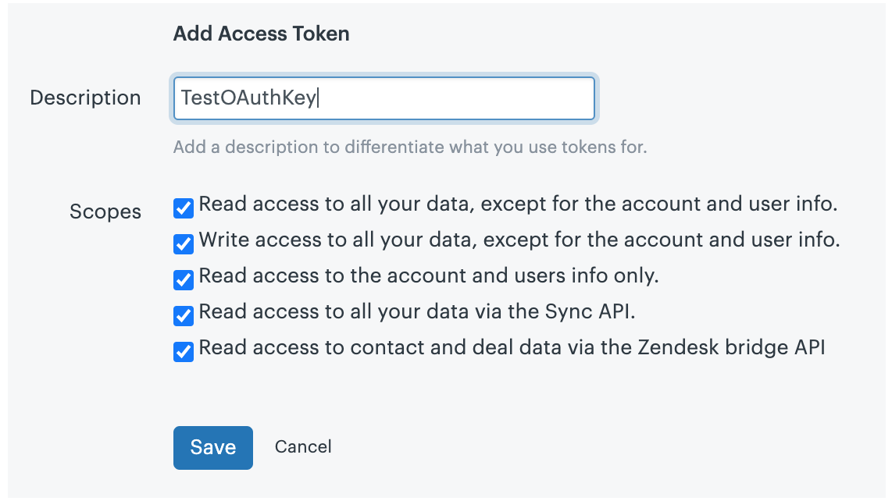
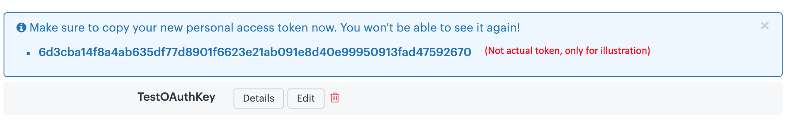

# Real-time capture of a Chat transcript with Stream Chat
Can you imagine improving a chat experience in real-time during a chat experience? Would your chat applications be improved with more timely handling of customer chat inquiries? This post demonstrates how to leverage the powerful [Stream Chat API](https://getstream.io/chat/docs) to take action with a chat transcript as the transcript is happening, response by response. The techniques provided here will help you better understand key components of the Stream Chat API, so that you can leverage them for similar applications, either with [Zendesk Sell](https://www.zendesk.com/sell/) or other applications.

We show this through the use case of updating a Zendesk CRM Lead in real-time with the transcript messages of a **Customer** and **Sales Admin** during a chat-based sales inquiry.

The simplified process of this post assumes that a customer has already initiated a chat inquiry with customer support, so it provides two browser tabs, an endpoint for the **Sales Admin**, and an endpoint for a **Customer**. Both the admin and customer chat screens pass the chat message to a `backend` API, which is the focus of this post. The `backend` calls the Zendesk Sell API to update the desired **Lead Description**. You will see that the Zendesk lead description is updated after either of the two chat screens send a message. The flow is illustrated below.


## Technical Overview
The applications described in this post are composed of:
* `frontend` which runs on http://localhost:3000/. This application supports both the customer and sales admin.
* `backend` which runs on http://localhost:8080/. This application will facilitate communication with Stream and Zendesk.

The `frontend` is bootstrapped using `create-react-app`, and the backend server is an `Express` app running on `nodejs`. Both the `frontend` and `backend` leverage Stream's [JavaScript library](https://github.com/GetStream/stream-js). The backend employs [axios](https://github.com/axios/axios) to PUT an update via the Zendesk Sell API to the Description of an existing Zendesk Lead. All the code required for this tutorial is available in the [GitHub repository](https://github.com/psylinse/stream-zendesk-lead-desc).

## Prerequisites

To follow along with the post, you will need a free [Stream](https://getstream.io/get_started) account, and a Zendesk Sell account (a Zendesk Trial can be obtained [here](https://www.zendesk.com/register/?source=zendesk_sell#step-1)).

The code in this post is intended to run locally, and assumes a basic knowledge of [React and React Hooks](https://reactjs.org/docs/hooks-intro.html), [Express](https://expressjs.com/), [Node.js](https://nodejs.org/en/), and [axios](https://github.com/axios/axios). The minimum knowledge required to configure Zendesk and use the API is explained in the post (see the [Zendesk Sell API](https://developer.zendesk.com/rest_api/docs/sell-api/apis) documentation to learn more). Please note, however, that you will need to create at least one Lead manually in Zendesk and and use the Lead ID when logging in, as described below.

The steps we will take to build the `backend` are:
1. [Registering and Configuring Zendesk](#registering-and-configuring-zendesk)
3. [Registering and Configuring Stream](#registering-and-configuring-stream)
2. [Create a Stream Chat Session](#create-a-stream-chat-session)

The steps to build the `frontend` are:
1. [Initiate the Frontend Chat Screens](#1---initiate-the-frontend-chat-screens)
2. [Authenticate Admin and Customer to the Chat](#2---authenticate-admin-and-custoemr-to-the-chat)
3. [Send messages to Zendesk](#3---send-messages-to-zendesk)
4. [Miscellaneous Backend Endpoints](#4---miscellaneous-backend-endpoints)

### Registering and Configuring Zendesk

To integrate Stream with the Zendesk Sell API, you must configure the OAuth security settings in Zendesk Sell with the following steps: 

1. Click on the `Settings` gear to the right of the top menu


2. Click on `OAuth` under the `Integrations` menu


3. Click on `+ Add Access Token`


4. Complete description and leave settings unchanged (more restrictive settings may be required for your application) and click `Save`



5. Copy the access token, which you will need to configure your backend communication with Zendesk.



You will update the backend with this Zendesk OAuth Token as explained in the next section.

### Registering and Configuring Stream

This application uses three environment variables:

- STREAM_API_KEY
- STREAM_API_SECRET
- ZENDESK_CRM_TOKEN

You will find a file in the Backend folder, `.env.example`, that you can rename to create a `.env` file.

To get the Stream credentials, navigate to your [Stream.io Dashboard](https://getstream.io/dashboard/)


Then click on "Create App"


Give your app a name and select "Development" and click "Submit"


Stream will generate a `key` and `secret` for your app. Copy these and update the corresponding environment variables in the `.env` file.


When the `.env` file has been created, you can start the backend by `npm start` command from the backend folder.

## Step 1 - Logging In

First let's build a React frontend that allows you to login as either a **Customer** or **Sales Admin**. Here's what our simplified logins screen looks like. 


Let's start by modifying the `App.js` file that was generated by `create-react-app`:

```jsx
// frontend/src/App.js:5
function Customer() {
  const [username, setUsername] = useState('');
  const [leadId, setLeadId] = useState('');
  const [isSalesAdmin, setIsSalesAdmin] = useState(null);

  if (username && leadId && isSalesAdmin !== null) {
    return <SalesChat username={username} leadId={leadId} isSalesAdmin={isSalesAdmin}/>;
  } else {
    return <div className="login">
      <div className="login-description">
        Type in a username to chat with. If you'd like to view the sales admin side of the chat be sure to hit the 'Login
        as Sales Admin' button.
      </div>
      <label>Customer Username</label>
      <input
        type="text"
        value={username}
        onChange={(e) => setUsername(e.target.value)}
        required
      />
      <label>Zendesk Lead ID</label>
      <input
        type="text"
        value={leadId}
        onChange={(e) => setLeadId(e.target.value)}
        required
      />
      <button onClick={() => setIsSalesAdmin(false)}>Login as Customer</button>
      <button onClick={() => setIsSalesAdmin(true)}>Login as Sales Admin</button>
    </div>
  }
}
```

We first present the user with the form (displayed above). This form contains a `username`, a `leadId` (to identify the Zendesk Sell lead record), and two buttons. One button is for logging in as the **Customer**, the other is to simulate the **Sales Admin** side of the chat. We use `useState` to the values of each of these fields. 

To keep this post focused, we won't generate leads dynamically. This means we'll need to get the lead id from Zendesk manually. To grab our lead id, go to your Zendesk dashboard and navigate to the "Leads" section. If you don't have a lead, click on "Add" and then "Add Lead". Fill in the necessary information then click "Save". Once you've done that you should see a lead id in the URL. It will be a 6-8 digit number such as `3180101`. If you want to see how to generate these leads programmatically when entering starting a Stream chat, see this [post](INSERT OTHER POST HERE).

Once you've filled out your `username` and `leadId`, after you select logging in as a **Customer** or **Sales Admin**, the application will render the `SalesChat` component. 

> Note: there are several methodologies for creating multiple user experiences for a front-end React app. While the method used here is convenient for learning, it's obviously not what you'd want in production as there's no real authentication or user management. Choose what's best for your needs on this step.

## Step 2: Configuring and Displaying a Stream Chat Channel

## Step 3: Syncing the Chat Transcript on Every Message

And that does it! You now understand how to integrate Stream Chat with Zendesk Sell to update Lead Descriptions (or any other Zendesk component as needed) during your sales chat experience.
