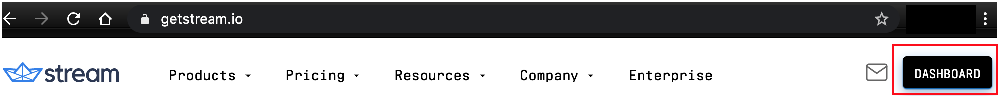
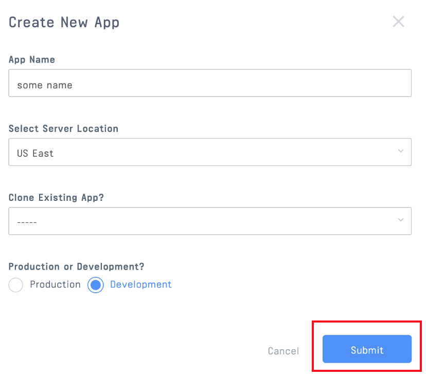
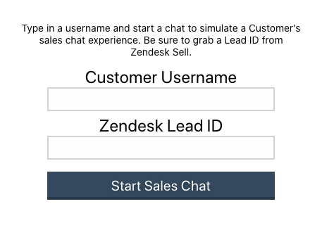

# Syncing Sales Chat Transcripts in Real-Time with Zendesk Sell CRM and Stream Chat
Can you imagine viewing your sales chat transcripts in real time from your sales CRM? Would your chat applications improve with more timely handling of customer chat inquiries? This post demonstrates how to leverage the powerful [Stream Chat API](https://getstream.io/chat/docs) to take action with a chat transcript as the transcript is happening, response by response. The techniques provided here will help you better understand key components of the Stream Chat API, so that you can leverage them for similar applications, either with [Zendesk Sell](https://www.zendesk.com/sell/) or other CRMs.

We show this through the use case of updating a Zendesk Sell Lead in real-time with the transcript messages of a **Customer**.

The simplified process of this post simply simulates a customer starting a sales chat. The customer chat components pass the chat message to a `backend` API, which is the focus of this post. The `backend` calls the Zendesk Sell API to update the desired **Lead Description**. You will see that the Zendesk lead description is updated after the customer send a message. The flow is illustrated below.


> Note: we only focus on the **Customer** experience in this post. Similar steps can be taken to sync the admin messages.

## Technical Overview
The applications described in this post are composed of:
* `frontend` which runs on http://localhost:3000/. This application supports the customer experience.
* `backend` which runs on http://localhost:8080/. This application will facilitate communication with Stream and Zendesk.

The `frontend` is bootstrapped using `create-react-app`, and the backend server is an `Express` app running on `nodejs`. Both the `frontend` and `backend` leverage Stream's [JavaScript library](https://github.com/GetStream/stream-js). The backend employs [axios](https://github.com/axios/axios) interact with the Zendesk Sell API. All the code required for this tutorial is available in the [GitHub repository](https://github.com/psylinse/stream-zendesk-lead-desc).

## Prerequisites

To follow along with the post, you will need a free [Stream](https://getstream.io/get_started) account, and a Zendesk Sell account (a Zendesk Trial can be obtained [here](https://www.zendesk.com/register/?source=zendesk_sell#step-1)).

The code in this post is intended to run locally and assumes a basic knowledge of [React and React Hooks](https://reactjs.org/docs/hooks-intro.html), [Express](https://expressjs.com/), [Node.js](https://nodejs.org/en/), and [axios](https://github.com/axios/axios). The minimum knowledge required to configure Zendesk and use the API is explained in the post (see the [Zendesk Sell API](https://developer.zendesk.com/rest_api/docs/sell-api/apis) documentation to learn more). Please note, however, that you will need to create at least one Lead manually in Zendesk and use the Lead ID when logging in, as described below.


## Configuration

This application requires three environment variables to be configured:

- STREAM_API_KEY
- STREAM_API_SECRET
- ZENDESK_CRM_TOKEN

You will find a file in the `backend` folder, `.env.example`, that you can rename to create a `.env` file.

When the `.env` file has been created and configured, you can start the backend by `npm start` command from the backend folder.

Before we do anything we start anything we need to create and configure our accounts. 

Let's get started!

### Registering and Configuring Zendesk

To integrate Stream with the Zendesk Sell API, you must configure the OAuth security settings in Zendesk Sell with the following steps: 

1. Click on the `Settings` gear to the right of the top menu


2. Click on `OAuth` under the `Integrations` menu


3. Click on `+ Add Access Token`


4. Complete description and leave settings unchanged (more restrictive settings may be required for your application) and click `Save`


5. Copy the access token, which you will need to configure your backend communication with Zendesk.


Update you're `.env` file with the token you just generated.

### Registering and Configuring Stream

Now we can configure Stream. To get the Stream credentials, navigate to your [Stream.io Dashboard](https://getstream.io/dashboard/)



Then click on "Create App"


Give your app a name and select "Development" and click "Submit"



Stream will generate a `key` and `secret` for your app. Copy these and update the corresponding environment variables in the `.env` file.


## Step 1 - Starting a Chat

First, let's build a React frontend that allows you to start a chat as a **Customer**. Here's what our simplified logins screen looks like. 



Let's start by modifying the `App.js` file that was generated by `create-react-app`:

```jsx
// frontend/src/App.js:5
function App() {
  const [username, setUsername] = useState('');
  const [leadId, setLeadId] = useState('');
  const [channel, setChannel] = useState(null);
  const [chatClient, setChatClient] = useState(null);

  const startChat = async () => {
    // ...
  }

  if (channel && chatClient) {
    return <SalesChat username={username} leadId={leadId} channel={channel} chatClient={chatClient}/>;
  } else {
    return <div className="login">
      <div className="login-description">
        Type in a username and start a chat to simulate a Customer's sales chat experience. Be sure to grab a Lead ID from Zendesk Sell.
      </div>
      <label>Customer Username</label>
      <input
        type="text"
        value={username}
        onChange={(e) => setUsername(e.target.value)}
        required
      />
      <label>Zendesk Lead ID</label>
      <input
        type="text"
        value={leadId}
        onChange={(e) => setLeadId(e.target.value)}
        required
      />
      <button onClick={startChat}>Start Sales Chat</button>
    </div>
  }
}
```

We first present the user with the form (displayed above). This form contains a `username`, a `leadId` (to identify the Zendesk Sell lead record), and a button to start the chat. We use `useState` to the values of each of these fields. 

To keep this post focused, we won't generate leads dynamically. This means we'll need to get the lead id from Zendesk manually. To grab our lead id, go to your Zendesk dashboard and navigate to the "Leads" section. If you don't have a lead, click on "Add" and then "Add Lead". Fill in the necessary information then click "Save". Once you've done that you should see a lead id in the URL. It will be a 6-8 digit number such as `3180101`. If you want to see how to generate these leads programmatically when entering starting a Stream chat, see this [post](https://getstream.io/blog/how-to-capture-leads-from-live-chat-in-zendesk/).

Once you've filled out your `username` and `leadId`, after you can click "Start Sales Chat". Upon clicking this, we fire our `startChat` function:

```jsx
  const startChat = async () => {
    const response = await axios.post("http://localhost:8080/stream-chat-credentials", {
      username, leadId
    });
    const token = response.data.token;
    const channelId = response.data.channelId;
    const chatClient = new StreamChat(response.data.apiKey);

    await chatClient.setUser({ id: response.data.userId, name: response.data.userName }, token);
    const channel = chatClient.channel("messaging", channelId);

    setChatClient(chatClient);
    setChannel(channel);
  }
``` 

Here we post our `username` and `leadId` to our backend. We'll look at what our backend does in a second, but first, let's see how our `frontend` handles the response. Our backend will return a few pieces of data required to configure our frontend client. Using the `apiKey` we set up our frontend `StreamChat` instance. We then configure the chat instance with the `userId`, `userName`, and the [Stream frontend token](https://getstream.io/blog/integrating-with-stream-backend-frontend-options/). Once our client is configured, we can create a reference to our channel via the `channelId`. We then set the React component's `chatClient` and `channel` state. 

Before we move on to rendering the chat channel, let's look at the backend `/stream-chat-credentials` handler: 

```javascript
// backend/server.js:15
const streamClient = new StreamChat(
  process.env.STREAM_API_KEY,
  process.env.STREAM_API_SECRET
);

// ...

// backend/server.js:57
app.post("/stream-chat-credentials", async (req, res) => {
  const { username } = req.body;
  try {
    let user = { id: username, name: username, role: 'user' };

    await streamClient.upsertUsers([user]);
    const channel = streamClient.channel('messaging', username, {
      name: 'Sales Chat',
      created_by_id: 'sales-admin'
    });

    await channel.create();
    await channel.addMembers([username]);

    const token = streamClient.createToken(user.id);

    res.send({
      userId: user.id,
      userName: user.name,
      channelId: channel.id,
      token,
      apiKey: process.env.STREAM_API_KEY
    });
  } catch (err) {
    console.log(err);
  }
});
```

Here we take the `username` from the request. We use our `streamClient` to create or update the user. Then we create a chat channel that is private to that user (and any [admin user](https://getstream.io/chat/docs/channel_user_role/?language=js)). Once the chat channel is set up, we generate the user's frontend token and respond to the user with the necessary data.

## Step 2: Displaying a Stream Chat Channel

Once you've started a chat you will see a screen that looks like this:


As you can see in Step 1, we have the data we need we mount the `SalesChat` component. This component takes the user information (`username` and `leadId`) and our Stream data (`chatClient` and `channel`). The main function of this component is to render the chat experience and hook into the message lifecycle to send each message to our `backend` to update the Lead in Zendesk Sell. Here's the entire component:

```jsx
// frontend/src/SalesChat.js:7
function SalesChat({ username, leadId, chatClient, channel }) {
  async function handleMessage(_channelId, message) {
    await axios.post("http://localhost:8080/messages", { message, author: username, leadId: leadId });
    return channel.sendMessage(message);
  }

  return (
    <Chat client={chatClient} theme="commerce light">
      <Channel channel={channel} doSendMessageRequest={handleMessage}>
        <Window>
          <h1>
            Customer Support Chat: {channel.id}
          </h1>
          <MessageList/>
          <MessageInput focus/>
        </Window>
      </Channel>
    </Chat>
  );
}
```

Using the `chatClient` and `channel` we render the chat experience with [Stream's Chat Messaging UI Kit](https://getstream.io/chat/ui-kit/). The component hooks into the message lifecycle by configuring the `Channel` component's `doSendMessageRequest` prop. This prop allows us to intercept the message before it goes to Stream's API. Inside of `handleMessage` we send the message, along with the `author` and `leadId` to our `backend`'s `/messages` endpoint. Once the message has been handled by our backend, we send the message to the `channel` by calling `sendMessage`.

## Step 3: Syncing the Chat Transcript on Every Message

Now that we have our chat experience mounted and are sending every message to our `backend`, we can sync these messages to our Zendesk Lead. Here's our `/messages` endpoint: 

```javascript
// backend/server.js:33
app.post('/messages', async (req, res) => {
  try {
    const leadId = req.body.leadId;
    let previousTranscript = await getPreviousTranscript(leadId);
    const payload = {
      'description': `${previousTranscript}\n${req.body.author}: ${req.body.message.text}`
    }
    const headers = {
      'Accept': 'application/json',
      'Content-Type': 'application/json',
      'Authorization': `Bearer ${process.env.ZENDESK_CRM_TOKEN}`
    }
    await axios.put(
      'https://api.getbase.com/v2/leads/' + leadId,
      { data: payload },
      { headers: headers }
    );
    res.send({});
  } catch (err) {
    console.log(err);
    res.status(500);
  }
});
```

This endpoint appends the new message to the `description` field, with the author to it. Every time we update the `description` field, it will overwrite the previous data. In order to append to what was there, we need to look up the previous transcript via `getPreviousTranscript`:

```javascript
// backend/server.js:20
async function getPreviousTranscript(leadId) {
  const headers = {
    'Accept': 'application/json',
    'Content-Type': 'application/json',
    'Authorization': `Bearer ${process.env.ZENDESK_CRM_TOKEN}`
  }
  const response = await axios.get(
    `https://api.getbase.com/v2/leads/${leadId}`,
    { headers: headers }
  );
  return response.data.data.description || '';
}
```

This is simply a `GET` against the lead to get the previous `description` field out. Once we have the previous description we issue a `PUT` to update the lead with the new `description` field containing our appended message. 

That does it! You now understand how to integrate Stream Chat with Zendesk Sell to update Lead Descriptions (or any other Zendesk field as needed) during your sales chat experience.
